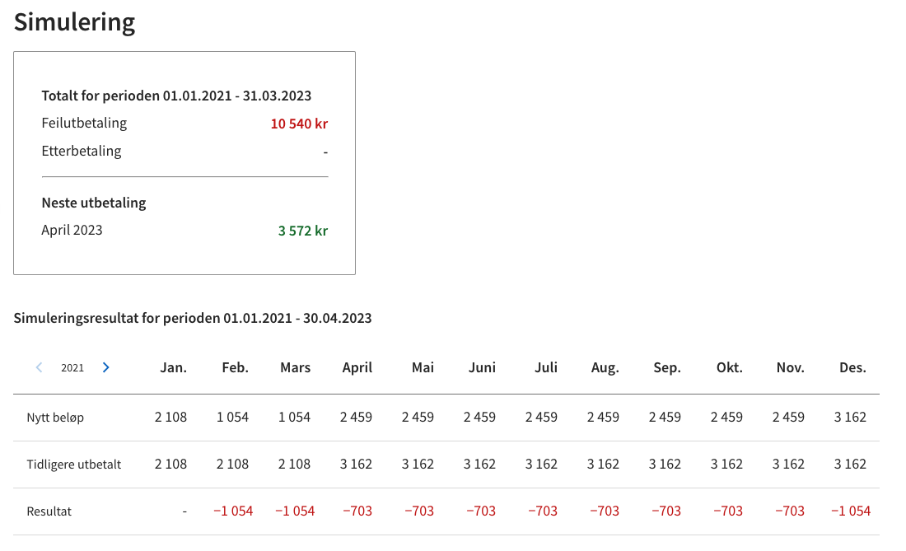
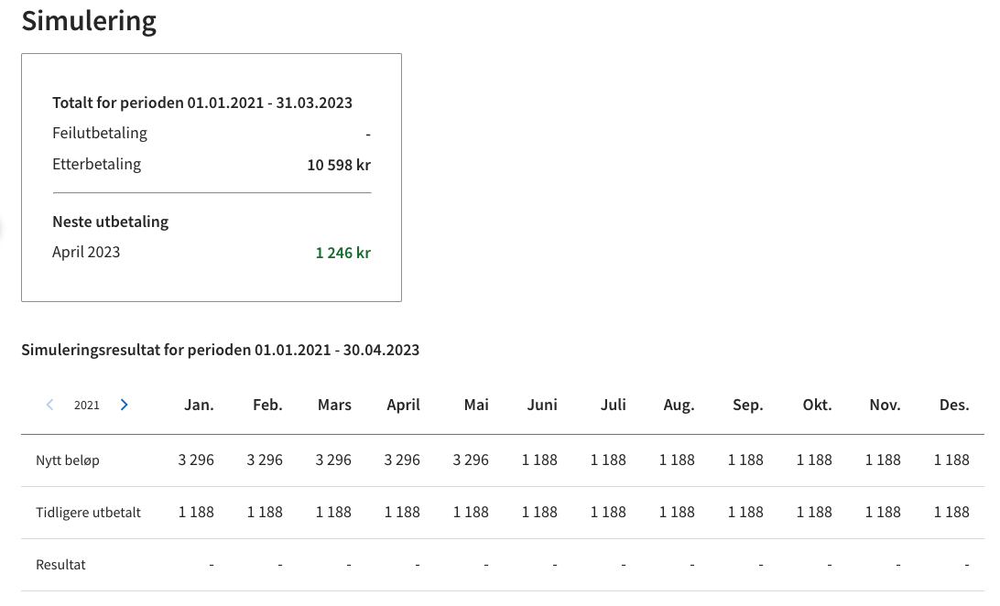

# Møte 21.04.23

# Oppdrag

Etter satsendring i mars dukket det opp en rekke 0 kr - utbetalinger på "Mitt NAV". I den forbindelse har vi funnet ut
at måten vi genererer utbetalingsoppdrag på er feil. Jobber nå med å finne ut hva som er riktig.

[Utbetalingsoppdrag og kjeding](https://github.com/navikt/familie-ef-iverksett/blob/oppdragsregenerator-ny/oppdrag.md)

# Simulering

## Oppsummert

* Vi bruker simulering til å se hvordan eventuelle endringer i en behandling vil påvirke det som skal utbetales, dersom
  vi iverksetter endringene mot økonomi.
* Vi sender over nye linjer for alle andeler tilkjent ytelse fra migreringstidspunkt/første innvilgelsestidspunkt. Dette
  for at saksbehandler skal få en oversikt over hele saken og ikke bare fra tidspunktet det oppstod en endring.
* Fra simuleringsresultatet ser vi kun på linjer/posteringer med `typeKlasse` `YTEL` og `FEIL`. Alt annet blir ignorert.
* I noen beregninger benytter vi kun linjer/posteringer fra `kodeFagomraade`: `BA` og `IT05`, i andre benytter vi også
  de fra `MIT05` (manuelle posteringer).

## Utfordringer

* Vi opplever at vår tolkning av simuleringsresultat gir oss et feilaktig bilde av hva slags beløp som faktisk er
  tilkjent, hva som faktisk er utbetalt samt hva som eventuelt blir reell feilutbetaling og etterbetaling.
* Kan føre til at vi oppretter feilaktige tilbakekrevinger samt skaper unødvendig støy hos NØS.
* Skaper forvirring for saksbehandler og kan være tidkrevende å finne ut hva som er riktig.

## Spørsmål

* Er det egentlig mulig, basert på simuleringsresultatet, å utlede korrekte tall for nytt beløp, tidligere utbetalt,
  feilutbetalinger og etterbetalinger per periode?
* Blir det mest riktig å inkludere manuelle posteringer i alle summeringer/beregninger på vår side? Vil det skape et
  riktigere bilde i flertallet av saker?
* Hva er forskjellen på beløp og sats på linjene/posteringene?
* Finnes det noe dokumentasjon/forklaring på simulerings API og tolkning av resultat?

## Dagens utregning av simuleringsoppsummering

### Nytt beløp

```
sumFeil = Sum av alle posteringer med typeKlasse=FEIL (unntatt manuelle posteringer)

sumPositiveYtelser = Sum av alle positive posteringer med typeKlasse=YTEL (inkludert manuelle posteringer)

Dersom sumFeil er større enn 0:
    
    Nytt beløp = sumPositiveYtelser - sumFeil

Ellers:

    Nytt beløp = sumPositiveYtelser
```

### Tidligere utbetalt

```
sumFeil = Sum av alle posteringer med typeKlasse=FEIL (unntatt manuelle posteringer)

sumNegativeYtelser = Sum av alle negative posteringer med typeKlasse=YTEL (inkludert manuelle posteringer)

Dersom sumFeil er mindre enn 0:
    
    Tidligere utbetalt = -(sumNegativeYtelser - sumFeil)

Ellers:

    Tidligere utbetalt = -sumNegativeYtelser
```

### Resultat

```
sumFeil = Sum av alle posteringer med typeKlasse=FEIL (untatt manuelle posteringer)

nyttBeløp = Samme som "Nytt Beløp", men her er manuelle posteringer ikke inkludert i sumPositiveYtelser.

tidligereUtbetalt = Samme som "Tidligere utbetalt" over.

Dersom sumFeil er større enn 0:
    
    Resultat = -sumFeil

Ellers:

    Resultat = nyttBeløp - tidligereUtbetalt

```

### Feilutbetaling

```
sumPositiveFeil = sum av alle positive posteringer med typeKlasse=FEIL (inkludert manuelle posteringer)

Feilutbetaling = sumPositiveFeil
```

### Etterbetaling

```
periodeHarPositiveFeil = sjekk om det finnes positive posteringer med typeKlasse=FEIL (inkludert manuelle posteringer)

sumYtelserFørForfall = sum av alle posteringer med typeKlasse=YTEL (inkludert manuelle posteringer)

Dersom periodeHarPositiveFeil:

    Etterbetaling = 0

Ellers:

    Etterbetaling = maks av 0 og sumYtelserFørForfall
```

# Eksempler

## Eksempel 1:

Fagsak: [https://barnetrygd.intern.nav.no/fagsak/2027805/2927722/simulering](https://barnetrygd.intern.nav.no/fagsak/2027805/2927722/simulering)



* Nytt beløp blir feil for perioden april-nov 2021. Skulle vært 2108 kr.
* Resultat blir feil for perioden april-nov 2021. Skulle vært -1054 kr.
* Resultat blir også feil i des 2021 - mars 2022. Skulle vært 0 kr.
* Det stemmer at det var en total feilutbetaling for perioden feb-nov 2021, men denne er gjort opp.

**Simuleringsresultat april 2021**

BA:

- 1054 kr YTEL
- 1054 kr YTEL
- -2108 kr JUST

IT05:

- 703 kr FEIL
- 703 kr YTEL
- 1405 kr JUST
- -703 kr MOTP
- -2108 kr YTEL

MIT05:

- 351 kr FEIL
- 351 kr YTEL
- 703 kr JUST
- -351 kr MOTP
- -1054 kr YTEL

|                  |Dagens  | Med manuelle | Uten manuelle | Vårt nye beløp, manuelle posteringer |
|------------------|--------|--------------|---------------|--------------------------------------|
|Nytt beløp        |2459 kr |2108 kr       | 2108 kr       | 2108 kr                              |
|Tidligere utbetalt|3162 kr |3162 kr       | 2108 kr       | 3162 kr                              |
|Resultat          |-703 kr |-1054 kr      | 0 kr          | -1054 kr                             |
|Feilutbetaling    |1054 kr |1054 kr       | 703 kr        | 1054 kr                              |
|Etterbetaling     |0 kr    |0 kr          | 0 kr          | 0 kr                                 |

## Eksempel 2:

Fagsak: [https://barnetrygd.intern.nav.no/fagsak/1688791/2964514/simulering](https://barnetrygd.intern.nav.no/fagsak/1688791/2964514/simulering)



* I denne saken fikk søker til og med mai 2021 utbetalt 2108 kr på (Dnr).
* Etter revurdering i juni 2021 fant man ut at søker egentlig skulle fått 1188 kr fra og med januar 2021. Feilutbetaling
  på 920 kr og ikke etterbetaling.
* Feilutbetaling ble behandlet hvor man så på hele perioden fra desember 2019 til og med mai 2021, og fant ut at det
  ikke skulle bli noen tilbakebetaling.

**Simuleringsresultat januar 2021**

BA:

- 594 kr YTEL
- 594 kr YTEL
- -428 kr JUST

IT05:

- 1188 kr JUST
- -1188 kr YTEL

MIT05:

- -760 kr JUST
- 2108 kr YTEL

|                  |Dagens  | Med manuelle | Uten manuelle | Vårt nye beløp, manuelle posteringer |
|------------------|--------|--------------|---------------|--------------------------------------|
|Nytt beløp        |3296 kr |3296 kr       | 1188 kr       | 1188 kr                              |
|Tidligere utbetalt|1188 kr |1188 kr       | 1188 kr       | 1188 kr                              |
|Resultat          |0 kr    |2108 kr       | 0 kr          | 0 kr                                 |
|Feilutbetaling    |0 kr    |0 kr          | 0 kr          | 0 kr                                 |
|Etterbetaling     |2108 kr |2108 kr       | 0 kr          | 0 kr                                 |